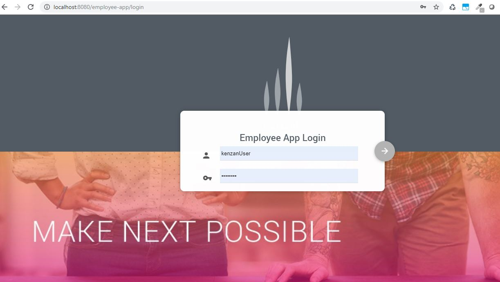
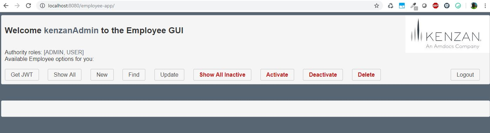
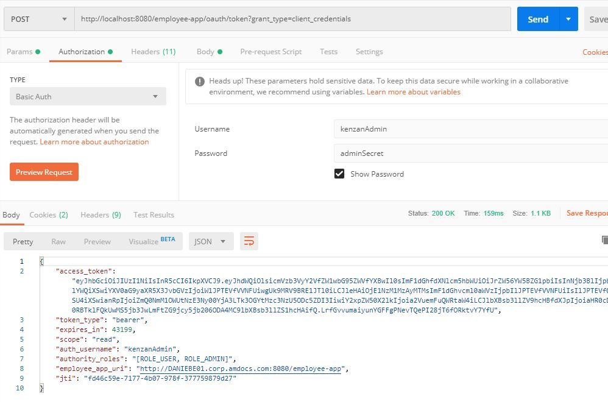
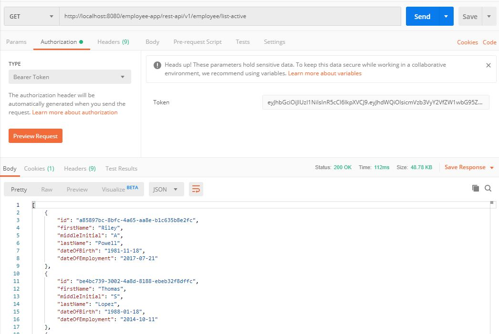
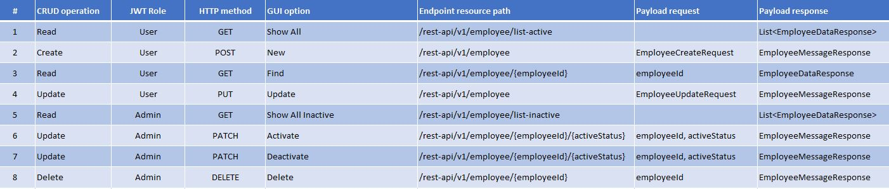
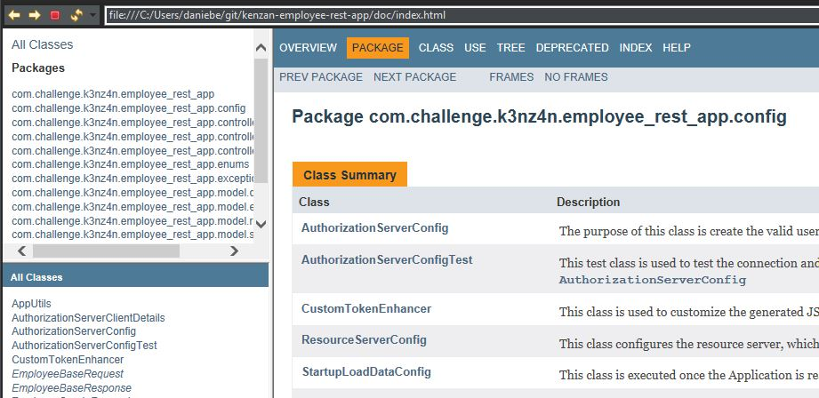
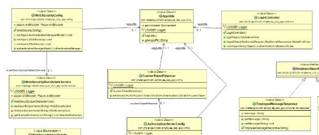

# Employee REST Application

The purpose of this task is create a Web application that exposes REST CRUD operations for employees.

# Features
  - The app uses Spring boot to run as a Microservice
  - It handles execution profiles (prod, dev, test, default)
  - Works with Java 8+ (uses Lambda Expressions, streams, method reference)
  - Implements MVC, DTO design patterns
  - Security with Open Authorization (OAuth) and JSON Web tokens (JWT)
  - In memory H2 DB
  - Thymeleaf template engine for the View layer
  - test cases
  - logging using Logback
  - three ways to test the REST APIs: custom GUI, Swagger UI, and direct APIs call

# Getting Started
In order to run the app, please follow below steps:

1. Download the source code from the repository:
```sh
$ git clone https://github.com/danielmxuk/k3nz4n_employee_app.git
```

2. Compile the code (without test task, it is important because the test task includes a test that needs the app running separately)
```sh
$ gradle clean build customFatJar -x test 
```

3. Run the app by etiher way with Gladle or directly calling the app:
```sh
$ java -jar -Dspring.profiles.active=prod  build/libs/employee_rest_app-1.0.1-SNAPSHOT.jar

or 

$ gradle bootRun
```

# Running the Employee app
Once the application has started below message is showed:
```sh

  -> Loaded Employee data: (300 generated) (300 saved)   -  App ready to use, have fun :)

```

Now the app can be accessed from a Web browser as:
http://localhost:8080/employee-app/
[]

There are two users created for this app:

| UserName | Password | Auth Roles |
| -------- | -------- | -----------|
| kenzanAdmin | kenzanPass | USER, ADMIN |
| kenzanUser | userPass | USER |

Once logged, the main GUI is showed, from there, all the REST API can be tested (using the kenzanAdmin user, because the kenzanUser cannot access the ADMIN role REST APIs)

[]

In case it is required test the REST APIs from other tool such as Postman, it can be done as follow:

1. First retrieve a valid JWT:
[]

2. Then, use that JWT to call the REST APIs:
[]

The REST API can be accessed as follow:
[]

It is also possible test the endpoints using Swagger from:
http://localhost:8080/employee-app/swagger-ui.html

To run the application test, please from gradle from other terminal, so that the app can be running while the test is executed as follow:

```sh
$ gradle test
```
The expected output is as folow:
```sh
> Task :test

com.challenge.k3nz4n.employee_rest_app.config.StartupLoadDataConfigTest

  Test givenDBUser_whenRevokeToken_thenAuthorized PASSED (6s)
  Test testPreloadedEmployeesInDB PASSED

com.challenge.k3nz4n.employee_rest_app.EmployeeRestAppApplicationTests

  Test contextLoads PASSED

SUCCESS: Executed 3 tests in 28.4s

BUILD SUCCESSFUL in 33s
5 actionable tasks: 2 executed, 3 up-to-date

$ 
```

# Documentation
The javaDoc documentation is found into the doc/ directory:
[]

Also the class diagram is available from the src\main\resources\app_screenshots:
[](./src/main/resources/app_screenshots/employee_app_UML_class_diagram.jpg)

# Technical details
| Component | Technology | Details |
| -------- | -------- | -----------|
| DB | H2 | the setting can be found into the src/main/resources/application.properties and the schema.sql file |
| logging | Logback | The configuration is defined into the src/main/resources/logback.xml which contain the rules for logging |
| Authorization | OAuth/JWT | The main classes that handle this are: AuthorizationServerConfig and ResourceServerConfig |

# Author
* **Daniel Beltran Roman** - [mail](mailto:danielmxuk@gmail.com)

